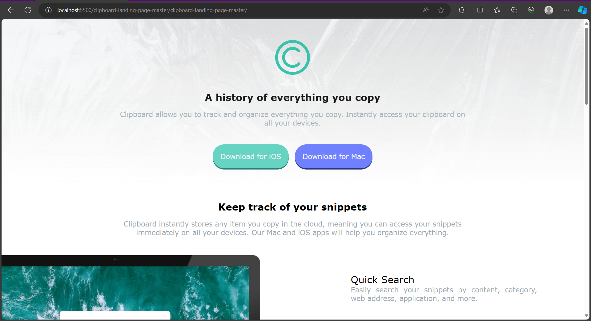
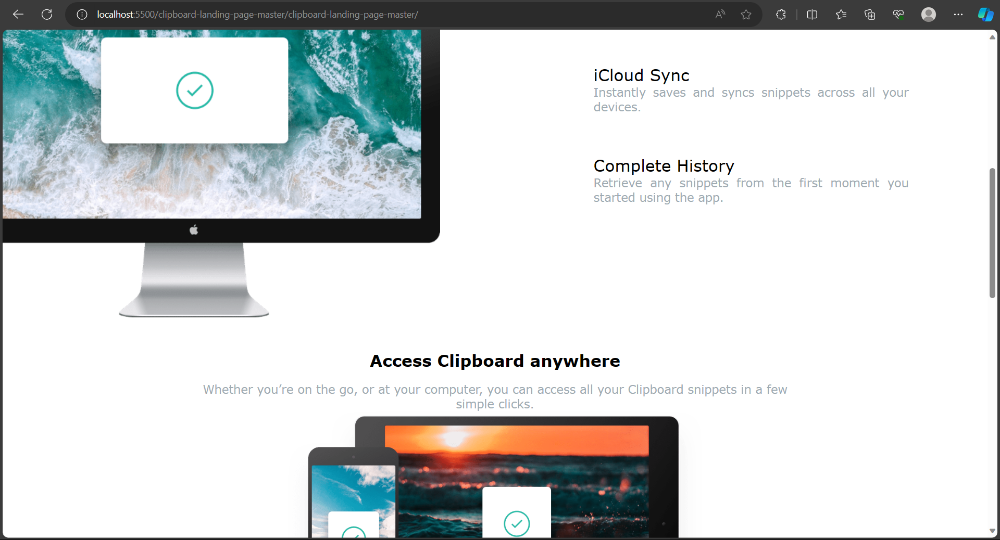
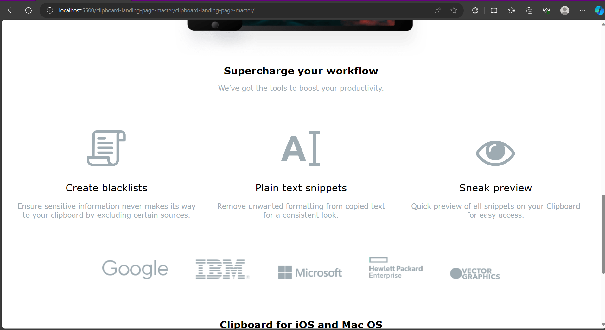
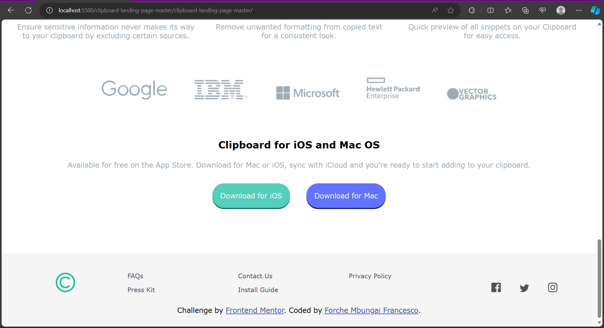

# Frontend Mentor - Clipboard landing page solution

This is a solution to the [Clipboard landing page challenge on Frontend Mentor](https://www.frontendmentor.io/challenges/clipboard-landing-page-5cc9bccd6c4c91111378ecb9). Frontend Mentor challenges help you improve your coding skills by building realistic projects. 

## Table of contents 

- [Overview](#overview)
  - [The challenge](#the-challenge)
  - [Screenshot](#screenshot)
  - [Links](#links)
- [My process](#my-process)
  - [Built with](#built-with)
  - [What I learned](#what-i-learned)
  - [Continued development](#continued-development)
- [Author](#author)
- [Acknowledgments](#acknowledgments)

**Note: Delete this note and update the table of contents based on what sections you keep.**

## Overview

### The challenge

Users should be able to:

- View the optimal layout for the site depending on their device's screen size
- See hover states for all interactive elements on the page

### Screenshot






### Links

- Solution URL: (https://www.frontendmentor.io/solutions/flexbox-margin-blthEszAb_)
- Live Site URL: (https://mbungai-francesco.github.io/Clipboard_page/)

## My process

### Built with

- Semantic HTML5 markup
- CSS custom properties
- Flexbox
- Mobile-first workflow

### What I learned

- I had to study flexbox for to help me complete the project

To see how you can add code snippets, see below:

```css
.uls ul:nth-child(2){
  text-align: center;
  width: 70%;
  display: flex;
  justify-content: space-evenly;
  margin: auto;
  padding-top: 2vh;
}
```

### Continued development

- Flexbox
- @media
- Responsiveness

## Author

- github - [Forche Mbungai Francesco](https://github.com/Mbungai-Francesco)
- Frontend Mentor - [@Mbungai-Francesco](https://www.frontendmentor.io/profile/Mbungai-Francesco)
- Twitter - [@MbungaiF](https://twitter.com/MbungaiF)
- Portfolio - [Portfolio](https://mbungai-francesco.github.io/Portfolio/)

## Acknowledgments

I thank God for the strength and resources he keeps sending my way.
